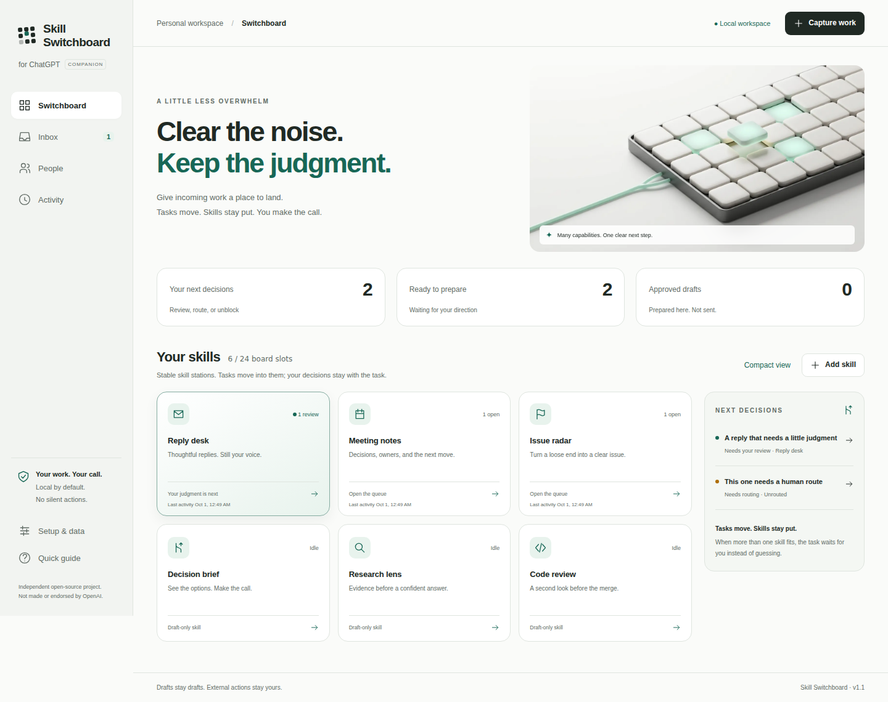

# Skill Switchboard

### Clear the noise. Keep the judgment.

**A local-first decision board for the work you do with ChatGPT, Claude, or Gemini.**
Capture a loose end, give it a skill, prepare a useful draft, and make the call.
Not another conversation to keep track of. Not a wall of agents pretending to work.

> **Tasks move. Skills stay put. Runners apply skills. People approve effects.**

[](https://github.com/bohselecta/ai-skill-switchboard/actions/workflows/verify.yml)
[](LICENSE)

<picture></picture>

*Actual interface with labeled fictional work. Editorial artwork in each edition is
AI-generated; interface captures are not. See [asset provenance](docs/ASSETS.md).*

## Three editions. One dependable workflow.

| Edition | Character | Start here |
|---|---|---|
| **Skill Switchboard for ChatGPT** | Pearl, graphite, mint. A precise, quiet workspace. | [App & guide](chatgpt/README.md) |
| **Skill Switchboard for Claude** | Warm ivory, terracotta, editorial typography. Room to think. | [App & guide](claude/README.md) |
| **Skill Switchboard for Gemini** | Airy blue, frosted-glass imagery, rounded surfaces. Clear next steps. | [App & guide](gemini/README.md) |

Each folder has its own artwork, instructions, README, MIT license, and an explicit
permission notice welcoming OpenAI, Anthropic, or Google. All three use the same
review and privacy engine; workspaces remain separate unless you deliberately
transfer a backup. Independent project by Hayden Lindley, not endorsed by a provider.

## Why this is useful

**Catch work before it disappears.** Paste a message, question, notes, or code; drop
a text file. Local rules suggest one skill. Ambiguous work stays visible for you to
route rather than being confidently misclassified.

**Start small, then shape the board.** Pick Everyday, Project Delivery, or Maker.
Six stable skill stations appear immediately. Open one and it becomes a focused chat
with that capability and its queue: several tasks can sit in the same skill, and a
skill can surface follow-up questions without becoming a fake employee. The board
holds up to 24 pinned stations while the skill library can be larger.

**Prepare with the account you already use.** Copy a scoped request into your chat,
then bring the result back. Or configure the optional local API bridge for a single
explicit request. No API key is needed for companion mode; there is no paid tier in
this repository. “Pro” describes the intended quality, not a new subscription.

**Review something concrete.** Source, purpose, uncertainties, draft, and provenance
live together. Edit, steer differently, reroute, or approve the exact draft. Nothing
is silently emailed, charged, signed, deleted, or deployed. An approved draft is not
a completed external action.

## Requirements

Use a modern browser with JavaScript. **Node.js 22 or newer** is needed only to run
the repository's persistent local server or build distributables. There are **zero
runtime package dependencies** and no `npm install` step for normal use. Optional
provider drafting needs your own API entitlement, server-side key, and model ID.
Browser testing additionally uses Python 3.10+ and pinned Playwright.

## Try a ready-to-use bundle

[**ChatGPT download**](https://github.com/bohselecta/ai-skill-switchboard/raw/refs/heads/main/chatgpt/skill-switchboard-chatgpt.zip) ·
[**Claude download**](https://github.com/bohselecta/ai-skill-switchboard/raw/refs/heads/main/claude/skill-switchboard-claude.zip) ·
[**Gemini download**](https://github.com/bohselecta/ai-skill-switchboard/raw/refs/heads/main/gemini/skill-switchboard-gemini.zip)

Unzip your edition and open its `references/companion.html`. No terminal, account
connection, or API key is needed. The ZIP includes the complete app, generated art,
reusable skill instructions, and license. For more predictable persistence, use the
local-server setup below. Export backups before closing or moving a file workspace.

## Get started

```bash
git clone https://github.com/bohselecta/ai-skill-switchboard.git
cd ai-skill-switchboard
npm start
```

Open **http://127.0.0.1:4173**, choose an edition, and select **Explore a sample board**.
The first useful action is reviewing the example reply: no account, key, or billing
setup. Choose **Start with my work** for an empty board. Keep the server running
while using the local app; stop it with Ctrl+C. Data is saved in that browser, not
on the Node server.

### Prefer a file you can open directly?

```bash
npm run build
```

Open `dist/skill-switchboard-chatgpt.html`, `...-claude.html`, or `...-gemini.html`.
Each is a self-contained companion with integrated artwork. Browser file-URL storage
varies; heed the in-app warning and export a backup. The local server is the preferred
persistent route. **Do not double-click the source `chatgpt/index.html`:** it uses ES
modules and needs the local server.

The same build produces three installable `skill-switchboard-*.zip` bundles, each
containing instructions and its complete app. See the edition guide for provider
installation details. A skill bundle is not a native synchronized dashboard.

## The everyday loop

**Capture → route → chat → prepare → review.** An email moves to Reply desk, a meeting
to Meeting notes, and a loose dependency to Dependency map. Open any skill to talk
with the capability, add another task directly to its queue, or answer a question it
surfaced from a draft. If work needs another capability, move the same task onward;
its journey and provenance stay attached. Copy or download an approved draft when
ready; sending it remains a separate human action.

Use **N** to capture, **/** to search, and **Escape** to close a dialog. The board stays
spatially stable while **Next Decisions** surfaces review, routing, and blocked work.
People cards are private responsibility notes, not invitations. Export a backup in
**Setup & data** before switching browsers or clearing data.

## Advanced setup and honest boundaries

Copy `.env.example` to `.env` only for optional direct API drafting. Fill in the key
and exact model for your chosen provider, restart the local server, then review the
separate billing confirmation on every generation. Never put keys in browser code,
source prompts, skill bundles, or git. The bridge uses fixed provider endpoints and
has no autonomous tools or automatic retries.

This release is a **working personal companion**, not an enterprise automation
platform. The skill-chat surface is real local UI over durable task state, but it
does not yet launch delegated agents or maintain a native provider conversation.
Automatic email/Slack/webhook ingestion, semantic embeddings, native MCP UI, shared
team queues, SSO, cloud sync, and external execution are not implemented.
The source retains clear contracts for extending it rather than fake integrations.
Local history is not an immutable compliance audit; browser storage is unencrypted.

[Architecture](docs/ARCHITECTURE.md) · [Safety & privacy](docs/SECURITY.md) ·
[Contracts](docs/CONTRACTS.md) · [Product decisions](docs/DECISIONS.md) · [Current status](STATUS.md) ·
[Acceptance gates](docs/ACCEPTANCE.md) · [Next agent](docs/NEXT-AGENT.md)

## Verify and contribute

```bash
npm run check
python3 -m pip install -r tests/requirements.txt
python3 -m playwright install chromium
# In a second terminal, with npm start still running:
npm run test:browser
```

Tests cover the state machine, failure recovery, provider HTTP contracts, and actual
browser paths across all three editions. Provider responses in tests are fixtures,
not live paid calls. Browser reports and captures are attached to Actions runs.
See `docs/verification.json` for the checked source when present. Neither software
tests nor beautiful imagery establish model quality or participant benefit.

After code or bundled-instruction changes, run `npm run package` and commit the
three refreshed edition ZIPs; CI rejects stale committed bundles.

Keep contributions bounded, reversible, and consistent with [AGENTS.md](AGENTS.md).
Use synthetic examples in issues. Do not submit personal task content or secrets.

## License and offering

MIT, copyright 2026 Hayden Lindley. Permission is granted to everyone, including
commercial reuse with the license notices preserved. The provider-specific notices
are explicit invitations to use the work, not exclusive grants or evidence of
adoption: [OpenAI](chatgpt/PERMISSION-GRANT.md),
[Anthropic](claude/PERMISSION-GRANT.md), [Google](gemini/PERMISSION-GRANT.md).
Third-party names and marks remain their owners' property.
