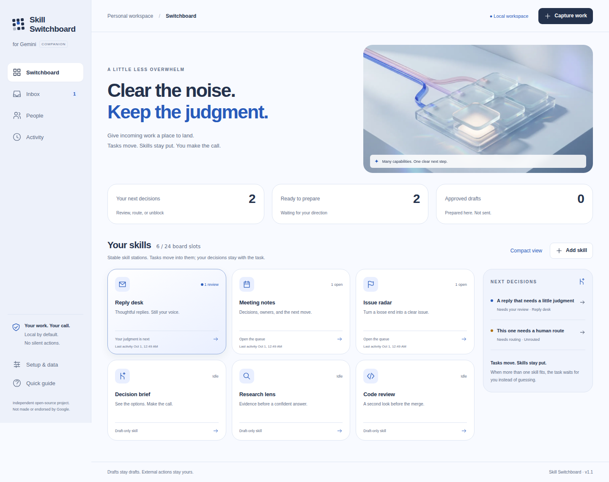

# Skill Switchboard for Gemini

### A clear blue workspace for your next useful move.

**Turn incoming work into a clear next decision—with Gemini helping prepare, and you
remaining in charge.** A polished personal workbench, not another subscription or an
agent activity feed. Start with six useful skills; shape the board up to 24.


[MIT](LICENSE) · [Permission granted to Google](PERMISSION-GRANT.md) ·
[Repository](../README.md) · [Verification](../docs/ACCEPTANCE.md)

## Less in your head. More ready to review.

Capture messages, meeting notes, questions, issues, or code in one place. The board
suggests a skill using visible local rules, keeps uncertainty in a triage inbox, and
shows exactly what the next preparation step will do. You see the source, the draft,
its origin, and any open questions together.

The edition is designed for individuals coordinating work, writing, reviewing, or
building. Use local people cards for responsibilities and preferences without
inviting anyone or implying they accepted a task. High-priority decisions surface
without shuffling your entire grid. All external actions remain yours.



*Actual browser capture with labeled fictional tasks. The sculpture above is
AI-generated editorial art, not a promised native Gemini interface.*

## Requirements

Modern browser; Node.js 22+ for the local server or builds. No runtime dependencies,
account connection, or API key is required for companion mode. Optional API drafting
requires a separate provider entitlement, server-side key, and model ID. A chat plan
is not treated as payment for API calls.

## Start in a minute

From the repository root:

```bash
npm start
```

Open **http://127.0.0.1:4173/gemini/**. Choose **Explore a sample board** to try a
complete review without transmitting anything, or **Start with my work** for an
empty board. The sample is explicitly fictional, not a live model result.

Choose **Everyday work** for replies, meeting notes, issues, decisions, research, and
code review. **Project delivery** adds stakeholder/dependency work. **Maker** focuses
on code, bugs, research, decisions, content, and data. Add skills only as you need
them; custom manifests define their purpose and negative scope, not permissions.

For a zero-server file, run `npm run build` and open
`dist/skill-switchboard-gemini.html`. Its code and art are self-contained. File-URL
storage differs by browser; use backups and follow any storage warning. The local
server is the preferred persistent mode. Do not open this source folder's
`index.html` directly; it loads ES modules.

## Your first real task

**Capture.** Paste the original source and a useful title. Add a source link, owner
label, due date, or priority only when helpful. Text files use `.txt` or `.md`, not
PDF parsing. No model runs during capture or routing. Multiple matches ask you to
choose; the app does not invent a confidence percentage.

**Prepare.** Open the task, choose a preparation direction, and use **Prepare with
Gemini**. Review what is safe to share, mark that task shareable, copy the request,
and paste it into your chat. The prompt includes that task and its skill contract,
not other tasks or people notes. Copying does not automatically insert or execute
anything in Gemini. A local brief is also available and is labeled deterministic.

**Review.** Paste the response back—plain text or the requested JSON. Inspect the
source and uncertainties, edit as needed, then check the review confirmation and
approve. Copy or download the draft. **Approved here does not mean sent anywhere.**
Changing source, steering, routing, draft, or ownership invalidates the old approval.

A simple example: “Could we meet Thursday?” becomes a draft asking for a time—not a
fabricated confirmed calendar invitation. The board holds the loose end without
claiming it has made a commitment.

### Reusable instructions inside Gemini

On accounts where Skills is available, use **Settings → Skills → Upload**. Select
`SKILL.md` from this folder or the built `skill-switchboard-gemini.zip`, review it,
and create the skill. The ZIP includes the complete companion HTML. A skill must not
pretend that providing a file also changed your browser's board.

Google documents a gradual personal-account rollout, account requirements, and a
transition from Gems to skills. Do not assume a work/school account has the same
options. The no-install fallback is to paste the prepared request into a normal
Gemini chat; an existing Gem can also hold the instructions where supported. There
is no need to change organizational settings to try synthetic work.

[Official skill setup](https://support.google.com/gemini/answer/17094296) ·
[Official Gems transition guidance](https://support.google.com/gemini/answer/18560919).
Checked September 30, 2026; account installation and Canvas rendering are not
claimed as tested.

## Optional: direct drafting through your own local API bridge

From the repository root, copy `.env.example` to `.env` and fill in:

```dotenv
GEMINI_API_KEY=your-own-server-side-key
GEMINI_MODEL=an-exact-model-id-enabled-for-your-account
```

Restart `npm start`, then use **Setup & data → Recheck local server**. A configured
server reveals the generation option; each request still requires an explicit
billing confirmation. Anthropic users with an unscoped key may also need
`ANTHROPIC_WORKSPACE_ID`, as documented by their account's API authentication guide.

The bridge uses fixed endpoints, size limits, a timeout, one active request, no tools,
and no automatic retries. Errors remain visible and retry is your choice. Cancel
stops local waiting but may not stop a request or charge already accepted by the
provider. There are no default models, claimed free credits, or keys in the browser.
Static hosting and standalone HTML are companion-only; do not expose the loopback
server as an unauthenticated public proxy.

## Keep the board yours

**N** captures. **/** searches. **Escape** closes a dialog. Keyboard focus stays inside
open dialogs; reduced-motion preferences are honored. Mobile layouts preserve the
same actions without a miniature desktop grid. Pause a skill to stop new automatic
routing; remove it only when no retained task references it.

Use **Setup & data → Export backup** before clearing data or moving browsers.
Backups contain private content. Restore validates and asks before replacement,
resets sharing to private, and returns approved drafts to review. Other editions are
separate; no invisible cross-provider synchronization occurs. Local activity is a
personal history, not an immutable audit trail.

| Problem | Recovery |
|---|---|
| Clipboard blocked | Copy from the visible text fallback. Nothing is silently lost. |
| A response will not import | Paste the complete JSON or plain draft text. The original source remains intact. |
| Saved board cannot be read | Download raw recovery before deliberately resetting. Corrupt data is not overwritten. |
| Another tab changed the board | Preserve unsaved text, then reload latest. Stale writes are rejected. |
| Browser cannot save | Export existing work, free space, or use the local-server origin in a supported browser. |
| Provider request fails | Check the visible error/configuration; explicitly return to preparation and retry. |

## What is—and is not—shipped

Working: local board, queues, routing, review and approval, custom skills, people
context, backups, three API adapters, standalone app, instruction bundle, tests,
and generated artwork integrated into the actual interface.

Not shipped: automatic Slack/email/webhook intake, semantic embeddings, native
synchronized UI inside Gemini, shared team accounts, SSO, cloud database, immutable
audit, or autonomous external execution. No account-installation, live model quality,
participant outcome, or enterprise compliance claim is made.

Run `npm run check` at the repository root. Browser testing instructions and
revision-linked evidence are in [Acceptance](../docs/ACCEPTANCE.md) and
[Status](../STATUS.md). API behavior is fixture-tested; real paid calls need separate
authorized acceptance. See [Security](../docs/SECURITY.md),
[Contracts](../docs/CONTRACTS.md), and [Next integration slice](../docs/NEXT-AGENT.md).

## Open source, offered to Google

Copyright 2026 Hayden Lindley. [MIT License](LICENSE), including commercial reuse.
[Explicit permission granted to Google](PERMISSION-GRANT.md), its affiliates, and
anyone else under the same non-exclusive terms. No separate permission is needed
for MIT-permitted uses. This is an independent offering, not an endorsement or
claim of receipt/adoption. Provider names and marks remain their owners' property.

[Back to all three editions](../README.md)
